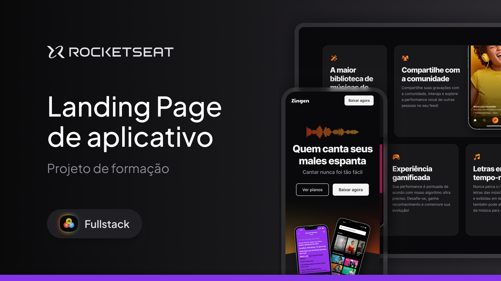

  

Projeto de uma landing page de produto desenvolvido durante as aulas sobre Responsividade na Rocketseat.

  <a href="#-tecnologias">Tecnologias</a>&nbsp;&nbsp;&nbsp;|&nbsp;&nbsp;&nbsp;
  <a href="#-projeto">Projeto</a>&nbsp;&nbsp;&nbsp;|&nbsp;&nbsp;&nbsp;

  

 

  

## 🚀 Tecnologias

Esse projeto foi desenvolvido com as seguintes tecnologias:

- HTML
- CSS

## Projeto

Projeto para desenvolvimento de Landing Page de marketing completa e responsiva de um aplicativo de Karaokê chamado Zingen.
